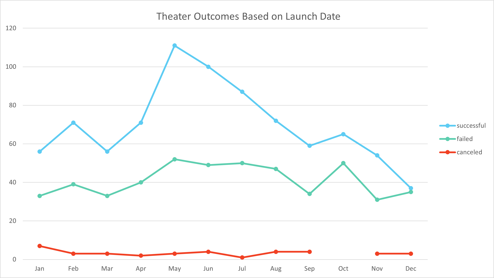
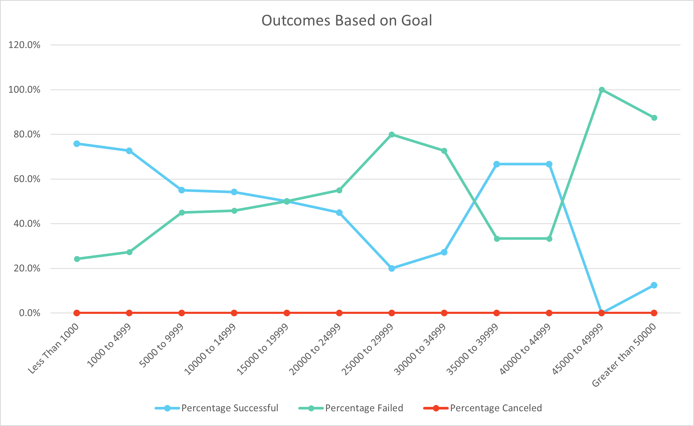

# Kickstarter Campaign Analysis

## Overview of Project

### Louise has launched a Kickstarter campaign for her up and coming play "Fever" and it had almost reached it's fundraising goal in a short amount of time. Louise is now interested in how other Kickstarter campaigns have done in relation their goals and launch dates. 

---

## Analysis and Challenges

Our base data set [**View Here**](./Kickstarter_Challenge.xlsx) was a list of over 4,000 recent kickstarter campaigns. Categorizing these campaigns based on location, start and end dates, outcomes and goals we are able to create comparisons to help support answers to Louise's questions.

### Analysis of Outcomes Based on Launch Date

The image below is a review of Kickstarter data for campaigns categorized as Theater/Plays, focusing specifically on outcome and campaign launch date.

### Analysis of Outcomes Based on Goals

The image below is a review of Kickstarter data for campaigns categorized as Theater/Plays, focusing specifically on outcome and campaign funding goals. This 

### Challenges and Difficulties Encountered

During our research of Kickstarter campaigns, we thankfully did not run into any difficulties. Given the nature of the dataset though, there are many challenges that someone could encounter. When creating mustiple graphs that will be used to compare subsections of the data that are similar to eachother it is important to create continuity between formatting such as color schemes, graph types and filters. If the formating structure varies to much in between graphs, it is possible to come up with inaccurate conclusions about the data set being referenced.

## Results

- Based on our review of **Theater Outcomes vs Launch Date** we can conclude that Theater focused Kickstarter campaigns have the highest success rates when starting in May, but have the lowest success rate when starting in December.

- What can you conclude about the Outcomes based on Goals?
Based on our review of **Theater Outcomes vs Launch Date** we can conclude that Theater focused Kickstarter campaigns have the highest success rates when starting in May, but have the lowest success rate when starting in December with a steadily decreasing success rate in between.

- While this data set does give us a good picture of what to expect from a limited number of kickstarter campaigns, there are some limitations to the dataset.
    - The Kickstarter campaigns we compared in this analysis do not break down into geographic location inside of country, assuming that major cities and rural towns have different interest rates in plays, the location that Lousie is planning to launch her play could effect the outcome of her funding campaign.
    - We were only able to review a limited number of Kickstarter campaigns between 2009 and 2017. Current interest level in new plays in 2021 could be different than previous years. 

- Additional information to be explored could include:
    - Success rate of Theater/Play Kickstarter campaigns year over year.
    - Success rate of theater/Play Kickstarter campaigns in comparison to Kickstarter campaigns from different categories.
    - Alternative crowdfunding options.
